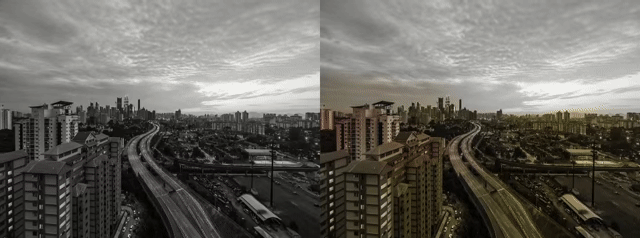

# Image Colorization
This is an example of realtime image colorization.



Example made with love by [Jonathhhan](https://github.com/Jonathhhan) 2022  
https://github.com/Jonathhhan

Video credits to [Videvo](https://www.videvo.net/video/time-lapse-day-to-night-city/2644/)

### TensorFlow2
The example uses a pretrained model converted to saved model format from [this repository](https://github.com/EnigmAI/Artistia/tree/main/ImageColorization/trained_models_v2).
The conversion process is rather simple:
```python
import tensorflow as tf

model = tf.keras.models.load_model('model.h5')
tf.saved_model.save(model, 'model')
```

### openFrameworks
In order to handle the ins and outs correctly we can take a look at the [python code](https://github.com/EnigmAI/Artistia/blob/main/ImageColorization/Image_Colorization_v2.py) for inference.
We can see that the model expects a grayscale image and outputs the missing two channels. Furthermore, the model is working in the lab color space. Using the ofxCv addon we can easily convert the pixels to the correct range.
