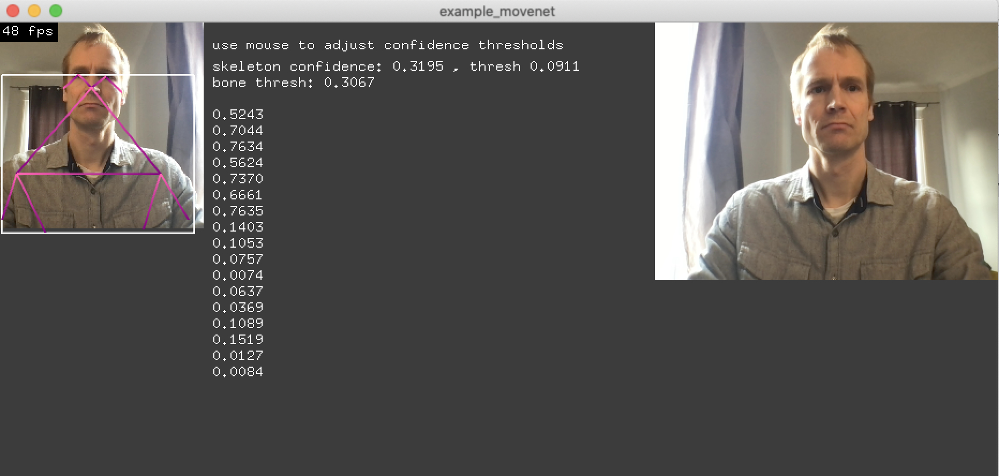

# Movenet example - singlepose lightning
This is an example for realtime 2D singlepose skeleton tracking over an RGB camera or video using the MoveNet model.





Example made with love by Natxopedreira 2021  
https://github.com/natxopedreira

With additions for [singlepose model](https://tfhub.dev/google/movenet/singlepose/lightning/4) use by Stephan Schulz 2022


### TensorFlow2 
For this example we do not have the python code that produced the model. However, a SavedModel of MoveNet has been uploaded to [TensorFlow Hub](https://tfhub.dev).

### openFrameworks
As with other examples, we will make use of the `ofxTF2::ThreadedModel`. Please take a look at other examples for more information on how to use the class.

Taking a look at the output of the `saved_model_cli` tool we find that this MoveNet model expects the input to be a color image of dimensions [1, height, width, 3].
```shell
dtype: DT_INT32
shape: (1, -1, -1, 3)
```
__NOTE__: Remember the first dimension is always the batch size which is usually 1 in realtime applications.

And outputs a vector of 1 skeleton.
```shell
dtype: DT_FLOAT
shape: (1, 1, 17, 3)
```
The skeleton contains 51 (17x3) values with defined meaning. The values make up the parameters of the 17 joints or key points.
Each key point consists of three values: x and y position and the confidence of the network it has for that key point.

### Further Reading
https://blog.tensorflow.org/2021/05/next-generation-pose-detection-with-movenet-and-tensorflowjs.html
