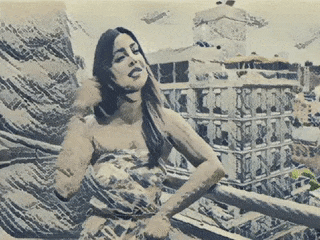

# Realtime Arbitrary Style Transfer
This is an example for realtime Arbitrary Image Stylization using [Magenta's arbitrary-image-stylization model](https://tfhub.dev/google/magenta/arbitrary-image-stylization-v1-256/2).
Different from regular Image Stylization, this model is not trained on one specific style, but can apply any style given by an input style image.



Example made with love by [Jonathhhan](https://github.com/Jonathhhan) 2022  
https://github.com/Jonathhhan

Video available at this [Google Drive](https://drive.google.com/drive/folders/1VFnWwuu-YXDKG-N6vcjK_nL7YZMFapMU)


### TensorFlow2
For this example we do not have the python code that produced the model. However, a SavedModel has been uploaded to [TensorFlow Hub](https://tfhub.dev).

### openFrameworks
This model requires two inputs. One is the image that gets stylized and the other is the image providing the style.
Therefore, we need to use `ofxTF2::Model::runMultiModel` and set the inputs accordingly. 

Taking a look at the output of the `saved_model_cli` tool we find that this model expects the inputs to be:
```shell
  inputs['placeholder'] tensor_info:
      dtype: DT_FLOAT
      shape: (-1, -1, -1, 3)
      name: serving_default_placeholder:0
      
  inputs['placeholder_1'] tensor_info:
      dtype: DT_FLOAT
      shape: (-1, -1, -1, 3)
      name: serving_default_placeholder_1:0
```
Therefore, we setup up the model as follows:
```C++
model.setup({ {"serving_default_placeholder"} ,{"serving_default_placeholder_1"} },
	{"StatefulPartitionedCall"} );
```
__NOTE__: Remember the first dimension is always the batch size which is usually 1 in realtime applications.  Please refer to `example_basics_multi_IO` for more information.

The image and video are both loaded from `bin/data`.

__NOTE__: it is always recommended to read the provided README in tfhub.dev:
> It is recommended that the style image is about 256 pixels (this size was used when training the style transfer network). The content image can be any size.


__NOTE__: You can modify the output dimensions in `src/ofApp.h`. 

### Further Reading
[Exploring the structure of a real-time, arbitrary neural artistic stylization network](https://arxiv.org/abs/1705.06830)