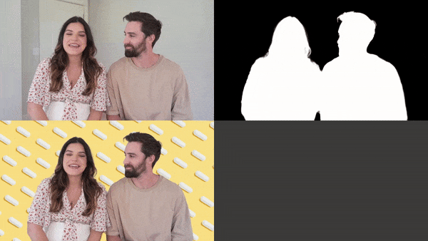

# Video Matting Example
Realtime background substraction using MobileNetV3. Model provided by https://github.com/PeterL1n/RobustVideoMatting

Example made with love by Natxopedreira 2021  
https://github.com/natxopedreira

### Other References

[Video sample](   
https://drive.google.com/drive/folders/1VFnWwuu-YXDKG-N6vcjK_nL7YZMFapMU)

[Background image](  
https://www.pexels.com/es-es/foto/capsulas-blancas-sobre-fondo-amarillo-3683056/)