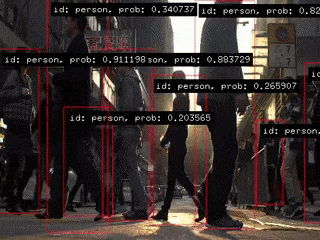

# Realtime Object Recognition 
Realtime Object Recognition on the COCO dataset using YOLOv4.

Example made with love by [Jonathhhan](https://github.com/Jonathhhan) 2022  
https://github.com/Jonathhhan

Video credits to [Videvo](https://www.videvo.net/video/busy-hong-kong-street-at-sunset/7906/)

Model provided by https://github.com/AlexeyAB/darknet

Model converted by https://github.com/hunglc007/tensorflow-yolov4-tflite

### Notes
The model was trained on the COCO dataset. The dataset consists of 80 everyday classes. Here is an excerpt of things it is able to recognize:
- person
- bicycle
- car
- bird
- cat
- umbrella
- handbag
- frisbee
- bottle
- wine glass
- fork
- spoon
- orange
- pizza
- ...

For the full list please checkout `bin/data/cocoClasses.txt`

### Tensorflow2
This example comes with a converted model. If you are interested in the approach of conversion feel free to check out [this repository](https://github.com/hunglc007/tensorflow-yolov4-tflite).

### OpenFrameworks
The model expects an image as input and outputs candidate regions for the objects of interests. Using a method called Non-maximum Suppresion (NMS) we can filter the proposals. 
For more information on NMS please check [this blogpost](https://towardsdatascience.com/non-maximum-suppression-nms-93ce178e177c).